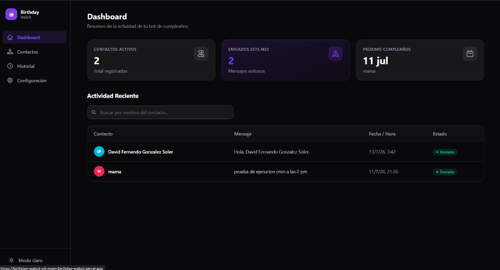
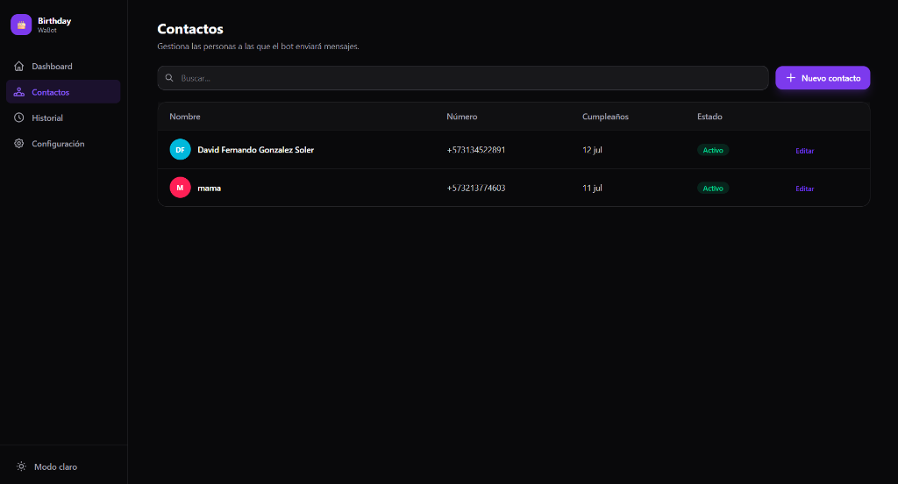
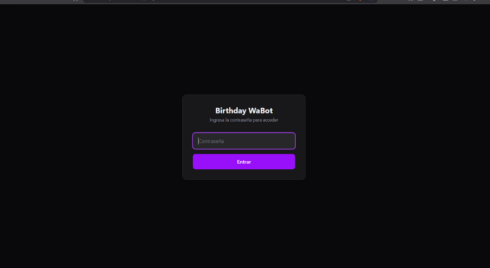
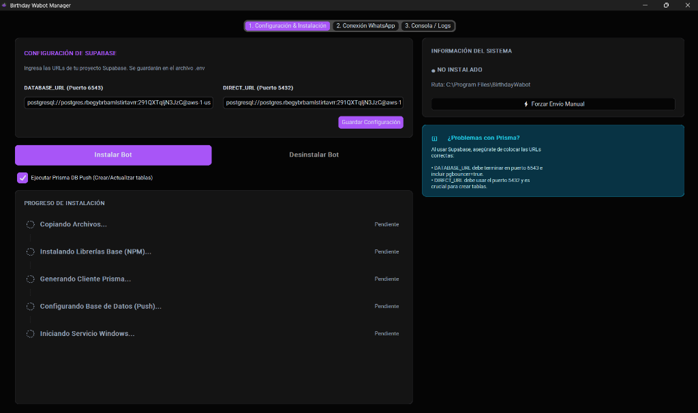

#  Birthday WaBot

**Birthday WaBot** es una solución automatizada para el envío de mensajes de cumpleaños a través de WhatsApp. Combina un bot robusto que funciona en segundo plano como servicio de Windows, con un panel de administración web moderno para gestionar contactos, ver el historial de envíos y configurar el comportamiento del bot.

---

## 🎯 ¿Qué hace este proyecto? (Contexto)

Administrar felicitaciones de cumpleaños manualmente para una lista grande de clientes, empleados o amigos puede ser tedioso. Birthday WaBot soluciona esto automatizando todo el proceso:

1. **Gestión de Contactos:** Agregas contactos con sus fechas de cumpleaños a través de una interfaz web intuitiva (Frontend).
2. **Revisión Diaria:** El Bot, ejecutándose silenciosamente en segundo plano, revisa todos los días a horarios programados (ej. 9:00 AM) si alguien cumple años.
3. **Envío Automático:** Si hay cumpleañeros, el bot se conecta a tu WhatsApp (usando tu propio número vinculado vía Código QR) y les envía un mensaje personalizado.
4. **Registro:** Cada envío queda registrado en el historial para que siempre sepas quién fue felicitado.

Todo esto está soportado por un **Manager de Escritorio (Windows)** que hace que instalar y monitorear el bot sea tan fácil como usar cualquier otra aplicación, sin necesidad de tocar la terminal.

---

## ✨ Características Principales

- 🤖 **Bot de WhatsApp Nativo:** Usa `@whiskeysockets/baileys` para conectarse directamente por WebSockets. No requiere tener el navegador ni Chrome abierto.
- 🖥️ **Manager de Escritorio (GUI):** Interfaz gráfica en Windows (`BirthdayWabotManager.exe`) para instalar dependencias, configurar la base de datos, vincular WhatsApp por QR y arrancar el bot como un **Servicio de Windows**.
- 🌐 **Panel Web Moderno:** Frontend construido con Next.js y Tailwind CSS para administrar todo desde cualquier navegador.
- 🔄 **Sincronización en Tiempo Real:** Base de datos PostgreSQL compartida (gestionada con Prisma) que asegura que el bot siempre tenga la lista de contactos más actualizada.

---

## 📸 Capturas de Pantalla

<table align="center">
  <tr>
    <td align="center">
      <b>Panel Web (Dashboard)</b><br>
      
    </td>
    <td align="center">
      <b>Gestión de Contactos</b><br>
      
    </td>
  </tr>
  <tr>
    <td align="center">
      <b>Pantalla de Acceso (Login)</b><br>
      
    </td>
    <td align="center">
      <b>Manager de Escritorio (Windows GUI)</b><br>
      
    </td>
  </tr>
</table>

---

## 🛠 Stack Tecnológico

| Capa        | Tecnología                        |
|-------------|-----------------------------------|
| **Frontend**| Next.js + Tailwind CSS + React    |
| **Bot**     | Node.js + @whiskeysockets/baileys |
| **Manager** | Python (CustomTkinter) compilado a .exe |
| **Base datos**| PostgreSQL (Supabase en prod)     |
| **ORM**     | Prisma (compartido frontend ↔ bot)|

---

## 🚀 Guía de Instalación (Entorno de Producción / Usuario Final)

Si solo quieres **usar** el programa en tu computadora con Windows, el proceso es completamente guiado:

1. Ejecuta el instalador/manager: `BirthdayWabotManager.exe`.
2. En la pestaña **"Configuración"**, pega la URL de tu base de datos PostgreSQL.
3. Ve a la pestaña **"Instalar Bot"** y presiona el botón de instalación. El manager se encargará automáticamente de:
   - Descargar e instalar Node.js (si no lo tienes).
   - Instalar las dependencias (`npm install`).
   - Sincronizar la base de datos.
   - Instalar el bot como un Servicio de Windows para que corra en segundo plano siempre.
4. Ve a la pestaña **"Conexión WhatsApp"** y escanea el código QR con tu celular (Dispositivos Vinculados).

¡Listo! El bot ya está corriendo. Busca el acceso directo "Birthday Wabot Manager" en tu Escritorio o Menú de Inicio cuando necesites volver a abrirlo.

---

## 💻 Guía de Desarrollo (Para Desarrolladores)

Si vas a modificar el código, sigue estos pasos para levantar el entorno local:

### 1. Clonar y Configurar
```bash
git clone <repo-url>
cd birthday-wabot
cp .env.example .env
# Edita el .env con las credenciales locales o de desarrollo
```

### 2. Base de Datos (Local)
Si no usas Supabase, puedes levantar PostgreSQL localmente:
```bash
docker compose up -d
```
Esto levanta PostgreSQL en `localhost:5432` con la base de datos `birthday_wabot`.

### 3. Instalar Dependencias y Sincronizar Prisma
```bash
npm install          # En la raíz
npx prisma generate
npx prisma migrate dev
```

### 4. Levantar el Panel Web (Frontend)
```bash
cd frontend
npm install
npm run dev
```
Disponible en `http://localhost:3000`.

### 5. Levantar el Bot en Modo Desarrollo
```bash
cd bot
npm install
node index.js
```
El bot mostrará un código QR en la terminal para que vincules WhatsApp.

---

## 📁 Estructura del Proyecto

```text
birthday-wabot/
├── README.md
├── .env                    ← Variables de entorno (BD, etc)
├── dist/BirthdayWabotManager.exe ← Aplicación de escritorio
├── wabot_manager.py        ← Código fuente del manager (Python)
│
├── prisma/
│   └── schema.prisma       ← Esquema de base de datos
│
├── frontend/               ← Panel de administración web (Next.js)
│
├── bot/                    ← Lógica del bot de WhatsApp (Node.js)
│   ├── index.js            ← Conexión y eventos de WhatsApp
│   └── scheduler.js        ← Sistema de cron jobs
│
└── docs/                   ← Carpeta para imágenes y documentación
```

---

## 📝 Notas y Metodología

- **Ship It Fast:** Usamos un enfoque ágil. El archivo `TASKS.md` funciona como nuestro tablero Kanban para planificar sprints.
- **Arquitectura Desacoplada:** El Frontend y el Bot funcionan como dos piezas independientes. Su único punto de encuentro es la base de datos.
- **Servicio Aislado:** Dado que el bot corre como servicio de Windows (Sesión 0), no puede mostrar popups tradicionales. Se comunica con el usuario a través de comandos nativos como `msg *` en caso de cierres de sesión.
